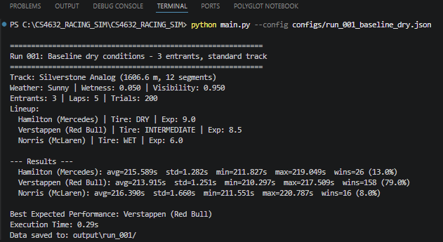
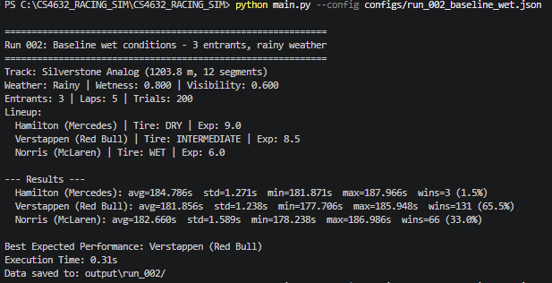

# CS4632_RACING_SIM
Official repository for the **Stochastic Motorsport Performance Simulator** for CS 4632 Modeling and Simulation.

## Overview
This project is a custom-built Python simulation that models motorsport race performance using physics-inspired equations, stochastic variability, and Monte Carlo trials. The simulation focuses on how vehicle setup, environmental conditions, tire strategy, and driver behavior interact to affect lap times and race outcomes.

This implementation is written from scratch in Python and does **not** rely on prebuilt simulation frameworks or premade simulation engines.

## Project Overview
The repository includes the complete simulator and full analysis workflow: sensitivity sweeps, scenario tables, statistical summaries (including confidence intervals), and matplotlib figures.

### What this README provides (Milestone 5)
Per course expectations, it includes:

| Expectation | Where in this README |
|-------------|----------------------|
| **Project description** | [Overview](#overview), [Project evolution (M1-M5)](#project-evolution-m1-m5) |
| **Installation instructions** | [Installation Instructions](#installation-instructions) |
| **Usage guide** | [Usage](#usage), [CLI Options](#cli-options) |
| **Parameter explanations** | [Configuration parameters](#configuration-parameters), [Preset Configurations](#preset-configurations-12-runs), [Configuration File Format](#configuration-file-format) |
| **Example outputs** | [Example outputs](#example-outputs) |

**Source code:** well-commented modules under `src/` (see [Architecture Overview](#architecture-overview)). **Configuration:** JSON presets in `configs/`. **Documentation:** this README, LaTeX report source under `report/`, and helper docs under `docs/`. **Architecture:** data-flow diagram below; class/activity UML figures ship with the final report (`report/figures/`). **Data formats:** [Output Structure](#output-structure) and [File Descriptions](#file-descriptions).

## Project evolution (M1-M5)
The project was built incrementally; each milestone refined both the model and how results are communicated.

- **Milestone 1 — Design:** Defined the problem, literature-backed modeling assumptions, and initial UML (class + activity). Established the conceptual split between deterministic physics-inspired lap modeling and stochastic outcome analysis.
- **Milestone 2 — First implementation:** Delivered an end-to-end vertical slice (track generation, environment, aero/cornering, Monte Carlo trials, console metrics). Identified the main modeling risk early: **wetness/tire interaction was overly dominant**, motivating later rebalancing work.
- **Milestone 3 — Simulator completion:** Generalized to **N entrants**, added a **JSON configuration system** and **`DataCollector`** exports (config, timeseries, events, summary, run index), and shipped **12 reproducible preset runs**. Physics updates (smoothstep grip, traction-limited acceleration, grip-aware braking, visibility penalty) addressed M2 feedback while keeping the model explainable.
- **Milestone 4 — Analysis & validation:** Added **`m4_analysis.py`** for **one-factor-at-a-time sensitivity sweeps**, aggregated CSVs, **95% confidence intervals**, scenario subsets, and **matplotlib figures** (also reflected in the final report).
- **Milestone 5 — Final delivery:** Synthesized prior milestones into the **LaTeX final report** (`report/main.tex`), **updated UML**, polished repository documentation, and prepared **video demo** materials (`docs/m5_video_script.md`, `docs/m5_submission_checklist.md`). The repo may ship with an **empty `output/`** folder so demos start clean; outputs appear after you run the simulator or analysis script.

## Features
The simulator includes comprehensive data collection, a configuration system, and systematic execution of 12 documented simulation runs.

Core features:

- **N-participant generalization** — the simulator now supports any number of drivers/cars, up from the hardcoded two-driver limit in M2
- **Wetness/tire sensitivity rebalancing** — smoothstep grip blending, traction-limited acceleration, grip-aware braking, and visibility penalties distribute performance across multiple dimensions rather than tire choice alone
- **JSON configuration system** — every run is defined by a self-contained JSON config file; the CLI supports single-config runs, batch `--run-all`, and parameter overrides
- **Full data export** — per-run output includes time-series CSV (trial × lap × entrant), segment-level events CSV, summary JSON, config JSON, and a master run index
- **12 documented runs** varying weather, field size, lap count, track complexity, tire strategy, and trial count

Analysis workflow:

- **One-factor-at-a-time sensitivity sweeps** across five inputs: wetness, visibility, laps, trial count, and track segment pairs
- **Aggregated CSV outputs**, statistical summaries, and matplotlib figures
- **Reusable analysis script** for regenerating data and visualizations

- **Script:** `m4_analysis.py` — run from the project root after installing dependencies:
  ```bash
  pip install -r requirements.txt
  python m4_analysis.py
  ```
  Use `python m4_analysis.py --figures-only` to regenerate PNGs from existing CSVs without re-running simulations.
- **Outputs:** `output/m4_analysis/` — per-sweep run folders (`run_m4_*`), `sensitivity_*.csv`, `scenario_m3_runs_subset.csv`, `m4_analysis_meta.json`, `m4_statistical_summary.json`, separate `run_index.json`, and `figures/*.png`.
- **Core simulation** is unchanged; analysis calls `run_simulation_core()` from `main.py`.

## What Is Implemented
- `Entrant` dataclass pairing a `Driver` with a `RaceCar`
- `Tire.mu_effective()` with smoothstep blending for gradual grip transitions
- `Driver.skill_factor()` multiplicative lap-time scaling by experience/aggressiveness
- `SimulationEngine` with:
  - aerodynamic drag and downforce (`compute_aero`)
  - friction-limited corner speed iteration (`compute_corner_vmax`)
  - traction-limited straight-line acceleration (`_traction_limited_accel`)
  - grip-aware braking deceleration (`_wet_brake_decel`)
  - visibility reaction-time penalty (`_visibility_penalty`)
  - detailed segment/lap/race data collection
  - N-entrant Monte Carlo trial execution
- `SimConfig` with JSON loading, CLI arg parsing, and validation
- `DataCollector` writing per-run CSV/JSON files and master index
- 12 preset configs in `configs/` covering dry, wet, cloudy, foggy, sprint, endurance, complex track, simple track, large field, and tire strategy scenarios

## Scope Updates From Original Proposal
Several items from the original project board were completed, partially addressed, or intentionally deferred during M3. These decisions were driven by the M2 feedback priorities (wetness sensitivity, CSV export, N-participant support) and the goal of producing a defensible, data-ready simulator rather than adding breadth at the cost of depth.

### Completed in M3 (moved from Todo/In Progress)
- **Tune tire friction values (#18)** — mu values recalibrated with smoothstep blending so per-lap gaps fall within stochastic noise, producing probabilistic rather than deterministic outcomes
- **Tune aerodynamic coefficients (#19)** — cars now have genuine tradeoffs (high-downforce/high-drag vs low-drag/low-downforce) instead of one car dominating every dimension
- **Export results to CSV (#20)** — full DataCollector pipeline: timeseries CSV, events CSV, summary JSON, config JSON, and master run index
- **Add configurable simulation parameters (#21)** — JSON config files, CLI arg parsing, parameter validation, default presets, and batch `--run-all` mode
- **Refine braking model before corners (#24)** — `_wet_brake_decel()` degrades braking proportionally with reduced tire grip in wet conditions
- **Refine wetness/tire sensitivity balance (#16)** — the primary M2 feedback item, addressed through five physics changes across straights, corners, braking, and visibility
- **Implement first-pass straight-line dynamics (#26)** — `_traction_limited_accel()` limits acceleration by whichever is lower: engine output or tire traction

### Partially Addressed
- **Improve segment transition realism (#22)** — braking transitions are now grip-aware, but the core model still passes exit speed directly as entry speed to the next segment without a coasting phase. A full lift-and-coast model was deprioritized in favor of the sensitivity rebalancing work.
- **Define clearer suspension impact (#23)** — `suspension_factor` is a configurable per-car parameter that scales tire mu_effective. A richer multi-parameter suspension model was deferred because the current single-factor approach is sufficient for the tire-strategy sensitivity analysis the simulation targets.
- **Add explicit powertrain / acceleration model (#25)** — traction-limited acceleration was added so grip constrains straight performance in wet conditions. A full torque-curve / gear-ratio powertrain was descoped because the simulation focuses on tire strategy and environmental sensitivity, not drivetrain engineering.

### Updates To Project Scope 
- **Extract parameter values from references (#30)** — values remain calibrated for balanced outcomes; analysis and the final report include **qualitative** order-of-magnitude checks against real racing. Literature-fitted parameters remain a possible future extension.
- **UML documentation (#31)** — architecture is documented here (data flow, module map) and in the **Milestone 5 final report** with updated class and activity diagrams (`report/figures/`).
- **Fuel load and pit-stop strategies** — out of scope for the current simulation model.
- **Tire degradation over race distance** — deferred; noted as future work in the final report.
- **Visualization and charting** — delivered via `m4_analysis.py` and matplotlib outputs under `output/m4_analysis/` (regenerated when you run the analysis script); key figures are also kept under `report/figures/` for the written report.

## Changes From M2
This implementation addresses Milestone 2 feedback by:
- **Fixing the wetness/tire sensitivity imbalance**: replaced linear grip interpolation with a smoothstep S-curve that widens the crossover zone; added traction-limited acceleration, grip-aware braking, and a visibility penalty so that wet conditions affect straights and braking, not just corners
- **Implementing CSV/JSON export**: the `DataCollector` writes four files per run (config, timeseries, events, summary) plus a master index
- **Expanding beyond two drivers/cars**: refactored all simulation data structures to support N entrants; demonstrated with runs of 3, 4, and 6 participants
- **Adding a configuration system**: JSON config files with CLI support, parameter validation, and default scenario presets

## Dependencies
- **Core simulator:** Python standard library only — no third-party packages required to run `main.py`.
- **Analysis figures:** `matplotlib` (listed in `requirements.txt`). Install with `pip install -r requirements.txt` before running `m4_analysis.py`.

## Installation Instructions

### Requirements
- Python 3.10 or newer
- A terminal or command prompt
- Optional: `matplotlib` for analysis figures (`pip install -r requirements.txt`)

### Setup
1. Clone the repository:
   ```bash
   git clone https://github.com/bryanhdzksu/CS4632_RACING_SIM.git
   ```
2. Open the project directory:
   ```bash
   cd CS4632_RACING_SIM
   ```
3. (Optional) Create and activate a virtual environment:
   ```bash
   python -m venv venv
   ```
   On Windows:
   ```bash
   venv\Scripts\activate
   ```
   On macOS/Linux:
   ```bash
   source venv/bin/activate
   ```

## Usage

### Run a single configuration
```bash
python main.py --config configs/run_001_baseline_dry.json
```

### Run all 12 preset configurations
```bash
python main.py --run-all
```

### Run with parameter overrides
```bash
python main.py --config configs/run_001_baseline_dry.json --seed 999 --num-trials 500
```

### Run with defaults (no config file)
```bash
python main.py
```

### Run M4 analysis pipeline (sweeps + figures)
```bash
pip install -r requirements.txt
python m4_analysis.py
```

### CLI Options
| Flag | Description |
|------|-------------|
| `--config PATH` | Path to a JSON configuration file |
| `--run-all` | Run every `.json` config in `configs/` sequentially |
| `--seed N` | Override the random seed |
| `--num-laps N` | Override the number of laps |
| `--num-trials N` | Override the number of Monte Carlo trials |
| `--run-id ID` | Override the run identifier |

## Configuration parameters
JSON configs drive each run. Top-level keys (see [Configuration File Format](#configuration-file-format) for a full example):

| Key | Role |
|-----|------|
| `run_id` | Directory name suffix (`output/run_<id>/`). |
| `description` | Human-readable label in logs and exports. |
| `random_seed` | Fixes RNG for reproducible trials (optional). |
| `num_laps` | Laps per simulated race. |
| `num_trials` | Monte Carlo trials (more → smoother statistics). |
| `collect_detail` | If `true`, writes segment-level `*_events.csv` (larger files). |
| `track` | Track name, number of straight/corner **pairs**, and random ranges for segment geometry. |
| `environment` | `weather`, `wetness` [0,1], `visibility` [0,1] when fixed; omitted → random race environment. |
| `entrants` | List of `{ driver, car, tire }` objects; each entrant is one competitor. |

**CLI overrides** (optional): `--seed`, `--num-laps`, `--num-trials`, `--run-id` apply on top of the JSON file (see [CLI Options](#cli-options)).

Per-entrant fields commonly tuned in presets: driver `experience` / `aggressiveness`; car `mass`, `cd`, `cl`, `max_accel`, `max_brake`, `top_speed`, `brake_efficiency`, `suspension_factor`; tire `compound`, `mu_dry`, `mu_wet`.

## Output Structure
The repository ships with an empty `output/` folder (except `.gitkeep`); running `main.py` or `--run-all` creates the files and subfolders below.

Each M3 preset run produces a directory under `output/`:
```
output/
├── run_index.json              # Master index of all runs
├── test_results.csv            # Consolidated rows (M3 / submission helper)
├── run_001/
│   ├── run_001_config.json     # Full parameter snapshot
│   ├── run_001_timeseries.csv  # One row per trial × lap × entrant
│   ├── run_001_events.csv      # One row per trial × lap × entrant × segment
│   └── run_001_summary.json    # Aggregate statistics
├── run_002/
│   └── ...
└── m4_analysis/                # M4 sweeps (separate index; does not replace M3 runs)
    ├── run_index.json
    ├── sensitivity_wetness.csv
    ├── sensitivity_visibility.csv
    ├── sensitivity_num_laps.csv
    ├── sensitivity_num_trials.csv
    ├── sensitivity_track_pairs.csv
    ├── scenario_m3_runs_subset.csv
    └── figures/*.png
```

### File Descriptions
| File | Format | Contents |
|------|--------|----------|
| `*_config.json` | JSON | Track layout, environment, entrant details, random seed |
| `*_timeseries.csv` | CSV | `trial, lap, entrant, lap_time, cumulative_time, weather, wetness` |
| `*_events.csv` | CSV | Segment-level: entry/exit speed, segment time, mu_effective |
| `*_summary.json` | JSON | Per-entrant avg/std/min/max times, wins, win percentage |
| `run_index.json` | JSON | Run metadata: ID, description, execution time, best performer |

## Example outputs
After `python main.py --config configs/run_001_baseline_dry.json`:

1. **Console** — printed summary: track summary, weather line, entrant lineup, per-entrant **avg / std / min / max** race time, **wins** and **win %**, best performer, wall-clock runtime.
2. **Disk** — under `output/run_001/` (paths depend on `run_id`): `run_001_config.json`, `run_001_summary.json`, `run_001_timeseries.csv`, and if `collect_detail` is true, `run_001_events.csv`. `output/run_index.json` appends one entry per saved run.
3. **Analysis** — after `python m4_analysis.py`, see `output/m4_analysis/sensitivity_*.csv`, aggregated JSON, and `output/m4_analysis/figures/*.png` (wetness, visibility, laps, trials/CI, track pairs).

For the **written report**, representative plots are also under `report/figures/` (so the repo stays useful even when `output/` is empty for demos).

### Example console screenshots
These two screenshots are the baseline examples used in the final report and video:

**Run 001 — baseline dry**



**Run 002 — baseline wet**



These examples show the exact terminal summary format produced by `main.py`: scenario metadata, entrant lineup, per-entrant aggregate race metrics, best expected performer, execution time, and the saved output folder for follow-up inspection.

## Configuration File Format
Each JSON config specifies:
```json
{
  "run_id": "001",
  "description": "Baseline dry conditions",
  "random_seed": 100,
  "num_laps": 5,
  "num_trials": 200,
  "collect_detail": true,
  "track": { "name": "...", "num_pairs": 6, "straight_range": [...], ... },
  "environment": { "weather": "Sunny", "wetness": 0.05, "visibility": 0.95 },
  "entrants": [
    {
      "driver": { "name": "Hamilton", "experience": 9.0, "aggressiveness": 0.7 },
      "car": { "name": "Mercedes", "mass": 798.0, "cd": 0.90, ... },
      "tire": { "compound": "DRY", "mu_dry": 1.04, "mu_wet": 0.88 }
    }
  ]
}
```

## Preset Configurations (12 Runs)
| Run | Description | Params Varied |
|-----|-------------|---------------|
| 001 | Baseline dry | Default (Sunny, 3 entrants, 5 laps) |
| 002 | Baseline wet | weather=Rainy, wetness=0.80 |
| 003 | Cloudy mixed | weather=Cloudy, wetness=0.30 |
| 004 | Large field dry | 6 entrants, Sunny |
| 005 | Large field wet | 6 entrants, Rainy |
| 006 | Long race | num_laps=10 |
| 007 | Sprint | num_laps=1 |
| 008 | Complex track | num_pairs=8, tight corners |
| 009 | Simple track | num_pairs=2, wide corners |
| 010 | High trials | num_trials=500, 4 entrants |
| 011 | Wrong strategy | All WET tires in dry conditions |
| 012 | Foggy mixed | Foggy, visibility=0.35, 4 entrants |

## Architecture Overview

### Main Components
- `main.py` — entry point, orchestrates config → simulation → data export; exposes `run_simulation_core()` for `m4_analysis.py`
- `m4_analysis.py` — M4 batch sweeps, CSV aggregates, matplotlib figures (optional dependency)
- `src/config.py` — JSON config loading, CLI parsing, validation, default entrants
- `src/simulation.py` — physics engine, lap/race/trial simulation, N-entrant support
- `src/data_collector.py` — CSV/JSON export, master index management
- `src/entrant.py` — `Entrant` dataclass pairing `Driver` + `RaceCar`
- `src/track.py` — `Track` and `TrackSegment` generation
- `src/environment.py` — weather, wetness, visibility conditions
- `src/tire.py` — tire compound friction model with smoothstep blending
- `src/car.py` — vehicle parameters (mass, aero, braking, top speed)
- `src/driver.py` — driver experience, aggressiveness, stochastic variance, skill factor
- `src/utils.py` — `RaceMetrics`, `EntrantMetrics`, statistical helpers

### Data Flow
```
JSON Config → SimConfig → build_track / build_environment / build_entrants
                           ↓
                    SimulationEngine.run_trials()
                           ↓
              (RaceMetrics, list[TrialResult])
                           ↓
                    DataCollector.save_run()
                           ↓
              output/run_XXX/ (CSV + JSON files)
```

## Project Structure
```
CS4632_RACING_SIM/
├── main.py
├── m4_analysis.py
├── README.md
├── requirements.txt
├── .gitignore
├── configs/
│   ├── run_001_baseline_dry.json
│   ├── run_002_baseline_wet.json
│   ├── ... (12 config files)
│   └── run_012_mixed_strategy_foggy.json
├── src/
│   ├── car.py
│   ├── config.py
│   ├── data_collector.py
│   ├── driver.py
│   ├── entrant.py
│   ├── environment.py
│   ├── simulation.py
│   ├── tire.py
│   ├── track.py
│   └── utils.py
├── output/
│   ├── .gitkeep                        # repository placeholder
│   ├── run_001/ ... run_012/           # created after simulation runs
│   └── m4_analysis/                    # created after running m4_analysis.py
├── report/
│   ├── main.tex
│   ├── references.bib
│   └── figures/                        # report figures (UML + analysis PNGs)
└── docs/
    └── Project_BOARD.png
```

## Troubleshooting
- If `python main.py` does not run, confirm that Python 3.10+ is installed.
- If import errors occur, make sure you are running from the project root directory.
- If `--run-all` finds no configs, verify the `configs/` directory contains `.json` files.
- If output is not created, verify the `output/` directory exists and is writable.
- If `m4_analysis.py` fails on `matplotlib`, run `pip install -r requirements.txt`.

## Notes
- **M3** delivered the full simulator, twelve preset configs, and repeatable batch output under `output/` (including optional `test_results.csv` when generated as part of your workflow).
- **M4** added isolated parameter sweeps, scenario comparison tables, validation narrative, statistics (means, variability, 95% CIs), and matplotlib figures via `m4_analysis.py`.
- **M5** packages the semester: final LaTeX report source in `report/`, updated UML figures in `report/figures/`, and demo aids in `docs/` (`m5_video_script.md`, `m5_submission_checklist.md`).
- The repository may ship with an **empty `output/`** (except `.gitkeep`) so recordings start from a clean tree; run `main.py` or `m4_analysis.py` to regenerate artifacts anytime.
